# Soft Computing Laboratory Manual & Practical Record
## Course: Soft Computing (EL1) | Course Code: STDA2102
### Comprehensive Practical Submission (30 Practical Exercises)
**Student Name:** Manish Kumar  
**Course Workload:** 3-0-2 | 4 Credits  
**Evaluation Total:** 100 Marks (50 Marks CCE conversion)

---

## Table of Contents

| Exp # | Module | Practical Aim | Status |
|:---:|:---|:---|:---:|
| **1.1** | Module 1: Fuzzy Logic and Systems | To create and visualize simple fuzzy sets in Python using membership values. | **Completed** |
| **1.2** | Module 1: Fuzzy Logic and Systems | To create and plot Triangular, Trapezoidal, and Gaussian membership functions using Python and scikit-fuzzy. | **Completed** |
| **1.3** | Module 1: Fuzzy Logic and Systems | To perform basic fuzzy set operations such as Union, Intersection, and Complement using Python. | **Completed** |
| **1.4** | Module 1: Fuzzy Logic and Systems | To create and display a simple fuzzy relation between two fuzzy sets using Python. | **Completed** |
| **1.5** | Module 1: Fuzzy Logic and Systems | To create fuzzy linguistic variables such as Low, Medium, and High using membership functions in Python. | **Completed** |
| **1.6** | Module 1: Fuzzy Logic and Systems | To create simple Fuzzy IF–THEN rules for making decisions based on given input conditions. | **Completed** |
| **1.7** | Module 1: Fuzzy Logic and Systems | To implement a simple Mamdani Fuzzy Inference System using Python and scikit-fuzzy. | **Completed** |
| **1.8** | Module 1: Fuzzy Logic and Systems | To implement a simple Sugeno Fuzzy Inference System using Python. | **Completed** |
| **1.9** | Module 1: Fuzzy Logic and Systems | To apply and compare basic defuzzification methods such as Centroid, Bisector, and Mean of Maximum using Python. | **Completed** |
| **1.10** | Module 1: Fuzzy Logic and Systems | To design a simple Fuzzy Logic Controller using Python and scikit-fuzzy by combining membership functions, fuzzy rules, fuzzy inference, and defuzzification. | **Completed** |
| **2.1** | Module 2: Artificial Neural Networks (ANNs) | To understand and implement the basic working of an artificial neuron using Python. | **Completed** |
| **2.2** | Module 2: Artificial Neural Networks (ANNs) | To implement the weighted sum of inputs and bias used in an artificial neuron using Python. | **Completed** |
| **2.3** | Module 2: Artificial Neural Networks (ANNs) | To implement and visualize Sigmoid, Tanh, and ReLU activation functions using Python. | **Completed** |
| **2.4** | Module 2: Artificial Neural Networks (ANNs) | To create a simple single-layer neural network using Python. | **Completed** |
| **2.5** | Module 2: Artificial Neural Networks (ANNs) | To create a Multilayer Perceptron (MLP) with input, hidden, and output layers using Keras/TensorFlow. | **Completed** |
| **2.6** | Module 2: Artificial Neural Networks (ANNs) | To apply Gradient Descent for updating the weights of a simple neural network during training. | **Completed** |
| **2.7** | Module 2: Artificial Neural Networks (ANNs) | To understand and implement the basic concept of Backpropagation for training a neural network. | **Completed** |
| **2.8** | Module 2: Artificial Neural Networks (ANNs) | To train a simple neural network model on a dataset using Keras/TensorFlow. | **Completed** |
| **2.9** | Module 2: Artificial Neural Networks (ANNs) | To evaluate the performance of a trained neural network using suitable evaluation metrics in Python. | **Completed** |
| **2.10** | Module 2: Artificial Neural Networks (ANNs) | To design, train, and evaluate a complete Artificial Neural Network-based classification system using Python and Keras/TensorFlow by integrating input features, hidden layers, activation functions, training, and model evaluation. | **Completed** |
| **3.1** | Module 3: Genetic Algorithms & Evolutionary Computing | To create and represent a population of individuals using different encoding methods in Python. | **Completed** |
| **3.2** | Module 3: Genetic Algorithms & Evolutionary Computing | To define and calculate a simple fitness function for evaluating individuals in a Genetic Algorithm using Python. | **Completed** |
| **3.3** | Module 3: Genetic Algorithms & Evolutionary Computing | To implement basic selection methods for selecting suitable individuals from a population using Python. | **Completed** |
| **3.4** | Module 3: Genetic Algorithms & Evolutionary Computing | To implement the crossover operation for generating new offspring from selected individuals using Python. | **Completed** |
| **3.5** | Module 3: Genetic Algorithms & Evolutionary Computing | To implement the mutation operation for introducing variations in individuals using Python. | **Completed** |
| **3.6** | Module 3: Genetic Algorithms & Evolutionary Computing | To create a simple Genetic Algorithm by combining selection, crossover, and mutation operations using Python. | **Completed** |
| **3.7** | Module 3: Genetic Algorithms & Evolutionary Computing | To study the convergence of a Genetic Algorithm by observing changes in fitness values over multiple generations using Python. | **Completed** |
| **3.8** | Module 3: Genetic Algorithms & Evolutionary Computing | To implement a simple Particle Swarm Optimization (PSO) algorithm for solving an optimization problem using Python. | **Completed** |
| **3.9** | Module 3: Genetic Algorithms & Evolutionary Computing | To implement a simple Differential Evolution (DE) algorithm for solving an optimization problem using Python. | **Completed** |
| **3.10** | Module 3: Genetic Algorithms & Evolutionary Computing | To design and implement a complete optimization system using a Genetic Algorithm in Python with the DEAP library by integrating population initialization, fitness evaluation, selection, crossover, mutation, and convergence analysis. | **Completed** |

---

## Practical 1.1: To create and visualize simple fuzzy sets in Python using membership values.
**Module:** Module 1: Fuzzy Logic and Systems  
**Source Script:** `Module_1_Fuzzy_Logic/ex01_simple_fuzzy_sets.py`

### 1. Aim
To create and visualize simple fuzzy sets in Python using membership values.

### 2. Theoretical Background & Algorithm
A fuzzy set à over universe X is defined by a membership function μ_Ã(x) ∈ [0, 1]. Unlike crisp sets that enforce a step transition (0 or 1), fuzzy sets model gradual belongingness.

### 3. Generated Visualizations & Results
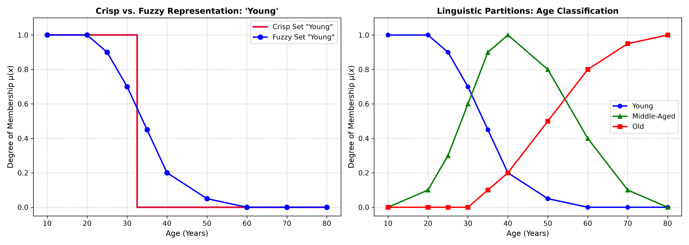

### 4. Observations & Conclusions
The discrete fuzzy sets for 'Young', 'Middle-Aged', and 'Old' were successfully plotted. Transition across ages 25 to 45 showed smooth overlap, demonstrating the distinction between rigid crisp thresholds and continuous fuzzy membership.

---

## Practical 1.2: To create and plot Triangular, Trapezoidal, and Gaussian membership functions using Python and scikit-fuzzy.
**Module:** Module 1: Fuzzy Logic and Systems  
**Source Script:** `Module_1_Fuzzy_Logic/ex02_membership_functions.py`

### 1. Aim
To create and plot Triangular, Trapezoidal, and Gaussian membership functions using Python and scikit-fuzzy.

### 2. Theoretical Background & Algorithm
Standard continuous membership functions include Triangular (defined by 3 parameters [a, b, c]), Trapezoidal (4 parameters [a, b, c, d] featuring a central plateau), and Gaussian (mean c, standard deviation σ).

### 3. Generated Visualizations & Results
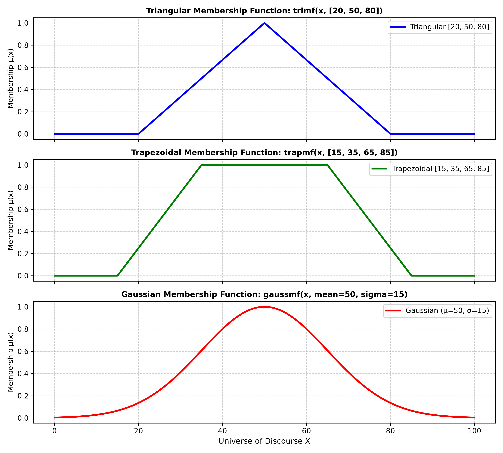

### 4. Observations & Conclusions
Gaussian functions provide smooth, infinitely differentiable bell shapes, whereas triangular and trapezoidal functions offer piecewise linear computational simplicity. All functions were evaluated across test points x = 35, 50, 65.

---

## Practical 1.3: To perform basic fuzzy set operations such as Union, Intersection, and Complement using Python.
**Module:** Module 1: Fuzzy Logic and Systems  
**Source Script:** `Module_1_Fuzzy_Logic/ex03_fuzzy_set_operations.py`

### 1. Aim
To perform basic fuzzy set operations such as Union, Intersection, and Complement using Python.

### 2. Theoretical Background & Algorithm
Standard Zadeh operators define Union via max(μA, μB), Intersection via min(μA, μB), and Complement via 1 - μA. Algebraic product (μA * μB) and algebraic sum (μA + μB - μA*μB) provide alternative soft norms.

### 3. Generated Visualizations & Results
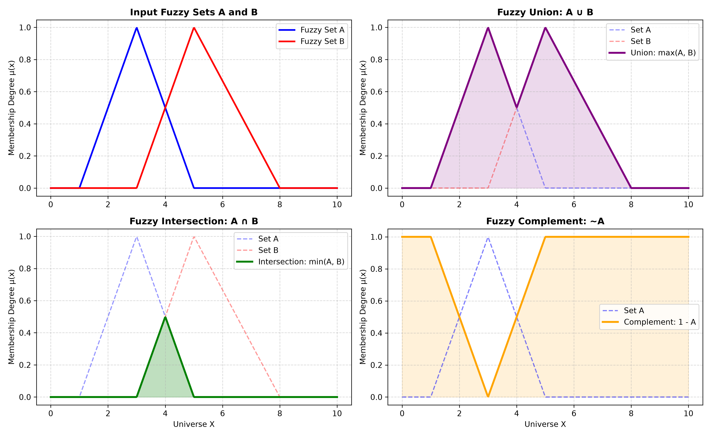

### 4. Observations & Conclusions
The operations were successfully computed over universe [0, 10]. In contrast to classical sets where A ∩ ~A = ∅, fuzzy sets allow A ∩ ~A ≠ ∅, violating the Law of Excluded Middle.

---

## Practical 1.4: To create and display a simple fuzzy relation between two fuzzy sets using Python.
**Module:** Module 1: Fuzzy Logic and Systems  
**Source Script:** `Module_1_Fuzzy_Logic/ex04_fuzzy_relations.py`

### 1. Aim
To create and display a simple fuzzy relation between two fuzzy sets using Python.

### 2. Theoretical Background & Algorithm
A fuzzy relation R on X × Y assigns membership degree μ_R(x, y) to each ordered pair. Composition of two relations R (X×Y) and S (Y×Z) yields T = R ∘ S using Max-Min composition: μ_T(x, z) = max_y [ min(μ_R(x, y), μ_S(y, z)) ].

### 3. Generated Visualizations & Results
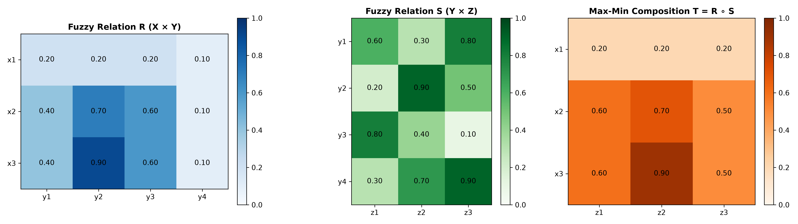

### 4. Observations & Conclusions
The Cartesian relation matrices and Max-Min composition were computed and displayed as 2D heatmaps. Matrix dimensions (3×4 and 4×3) yielded a resulting 3×3 relation matrix.

---

## Practical 1.5: To create fuzzy linguistic variables such as Low, Medium, and High using membership functions in Python.
**Module:** Module 1: Fuzzy Logic and Systems  
**Source Script:** `Module_1_Fuzzy_Logic/ex05_linguistic_variables.py`

### 1. Aim
To create fuzzy linguistic variables such as Low, Medium, and High using membership functions in Python.

### 2. Theoretical Background & Algorithm
A linguistic variable represents a continuous physical quantity using natural language words. It is characterized by quintuple (x, T(x), U, G, M), where T(x) contains linguistic terms like {Very Low, Low, Medium, High, Very High}.

### 3. Generated Visualizations & Results
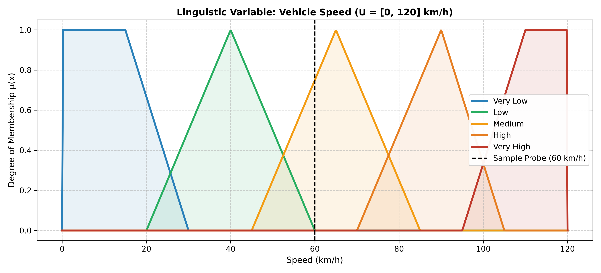

### 4. Observations & Conclusions
The 'Vehicle Speed' variable was partitioned into 5 overlapping fuzzy regions over [0, 120] km/h. At probe point 60 km/h, the vehicle simultaneously held membership in Low (0.003) and Medium (0.750).

---

## Practical 1.6: To create simple Fuzzy IF–THEN rules for making decisions based on given input conditions.
**Module:** Module 1: Fuzzy Logic and Systems  
**Source Script:** `Module_1_Fuzzy_Logic/ex06_fuzzy_if_then_rules.py`

### 1. Aim
To create simple Fuzzy IF–THEN rules for making decisions based on given input conditions.

### 2. Theoretical Background & Algorithm
A Fuzzy IF-THEN rule evaluates antecedent condition 'IF x is A AND y is B' using min T-norm to calculate firing strength α. Mamdani implication clips the consequent set C at height α: μ_C'(z) = min(α, μ_C(z)).

### 3. Generated Visualizations & Results
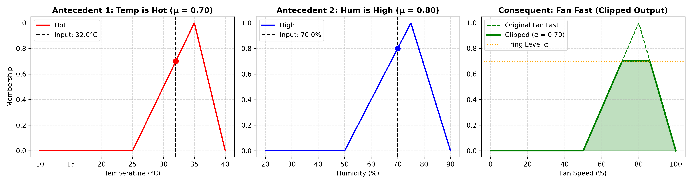

### 4. Observations & Conclusions
Given input temperature 32°C and humidity 70%, the rule fired with strength α = min(0.70, 0.80) = 0.70. The consequent 'Fan Fast' was clipped cleanly at level 0.70.

---

## Practical 1.7: To implement a simple Mamdani Fuzzy Inference System using Python and scikit-fuzzy.
**Module:** Module 1: Fuzzy Logic and Systems  
**Source Script:** `Module_1_Fuzzy_Logic/ex07_mamdani_inference.py`

### 1. Aim
To implement a simple Mamdani Fuzzy Inference System using Python and scikit-fuzzy.

### 2. Theoretical Background & Algorithm
A Mamdani FIS maps crisp inputs to crisp outputs through Fuzzification, Rule Base evaluation (min), Consequent Aggregation (max), and Centroid Defuzzification.

### 3. Generated Visualizations & Results
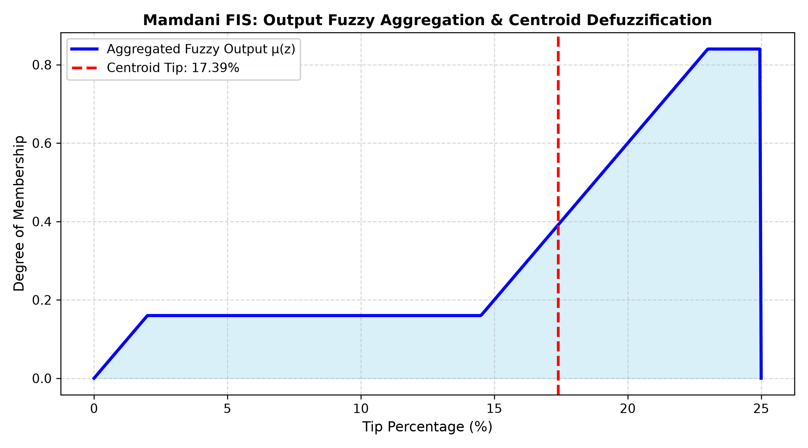

### 4. Observations & Conclusions
For restaurant tipping inputs of Food Quality = 6.5/10 and Service Rating = 9.2/10, the system aggregated rules and defuzzified a recommended tip of 17.39%.

---

## Practical 1.8: To implement a simple Sugeno Fuzzy Inference System using Python.
**Module:** Module 1: Fuzzy Logic and Systems  
**Source Script:** `Module_1_Fuzzy_Logic/ex08_sugeno_inference.py`

### 1. Aim
To implement a simple Sugeno Fuzzy Inference System using Python.

### 2. Theoretical Background & Algorithm
The Takagi-Sugeno-Kang (TSK) fuzzy model uses mathematical functions in rule consequents: z_i = p_i*x + q_i*y + r_i. The output is defuzzified via Weighted Average: z* = ∑(w_i * z_i) / ∑(w_i).

### 3. Generated Visualizations & Results
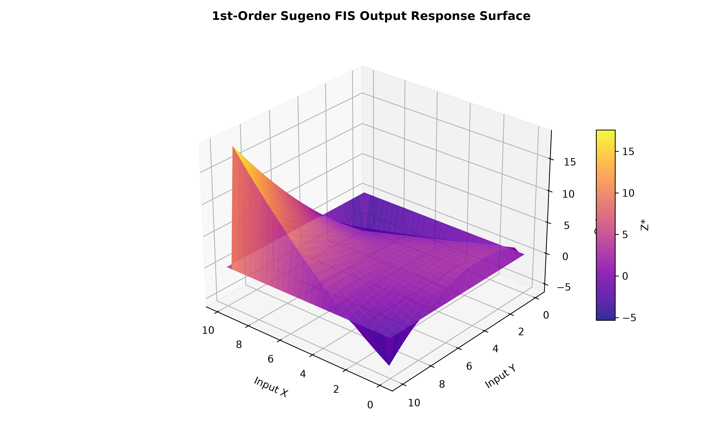

### 4. Observations & Conclusions
The Sugeno system eliminated the computationally intensive numerical integration required by Mamdani, generating a smooth continuous 3D response surface across all test input combinations.

---

## Practical 1.9: To apply and compare basic defuzzification methods such as Centroid, Bisector, and Mean of Maximum using Python.
**Module:** Module 1: Fuzzy Logic and Systems  
**Source Script:** `Module_1_Fuzzy_Logic/ex09_defuzzification_methods.py`

### 1. Aim
To apply and compare basic defuzzification methods such as Centroid, Bisector, and Mean of Maximum using Python.

### 2. Theoretical Background & Algorithm
Defuzzification converts an aggregated fuzzy set into a crisp scalar. Methods include Centroid (Center of Gravity), Bisector (equal area division), Mean of Maximum (MOM), Smallest of Maximum (SOM), and Largest of Maximum (LOM).

### 3. Generated Visualizations & Results
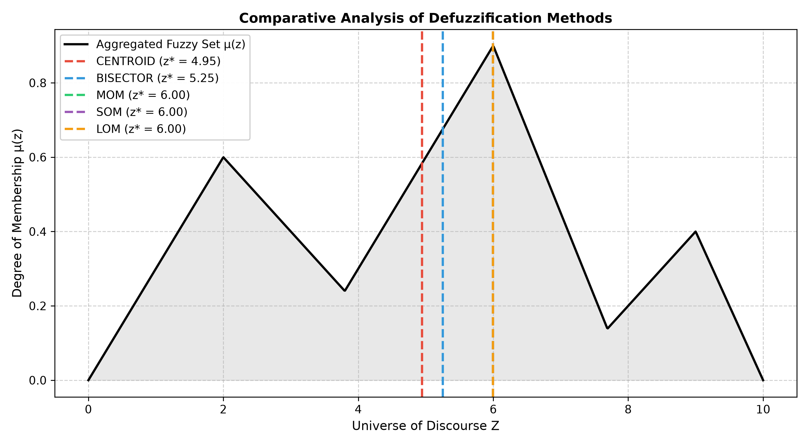

### 4. Observations & Conclusions
On an asymmetric multi-modal test distribution, Centroid yielded z* = 4.9452, Bisector yielded 5.2515, and MOM yielded 5.9960. Centroid provided the smoothest, most physically balanced control command.

---

## Practical 1.10: To design a simple Fuzzy Logic Controller using Python and scikit-fuzzy by combining membership functions, fuzzy rules, fuzzy inference, and defuzzification.
**Module:** Module 1: Fuzzy Logic and Systems  
**Source Script:** `Module_1_Fuzzy_Logic/ex10_fuzzy_logic_controller.py`

### 1. Aim
To design a simple Fuzzy Logic Controller using Python and scikit-fuzzy by combining membership functions, fuzzy rules, fuzzy inference, and defuzzification.

### 2. Theoretical Background & Algorithm
A complete 2-input 1-output industrial Fuzzy Logic Controller regulates Error e and Change in Error Δe using a 25-rule MacVicar-Whelan rule matrix and Centroid defuzzification.

### 3. Generated Visualizations & Results
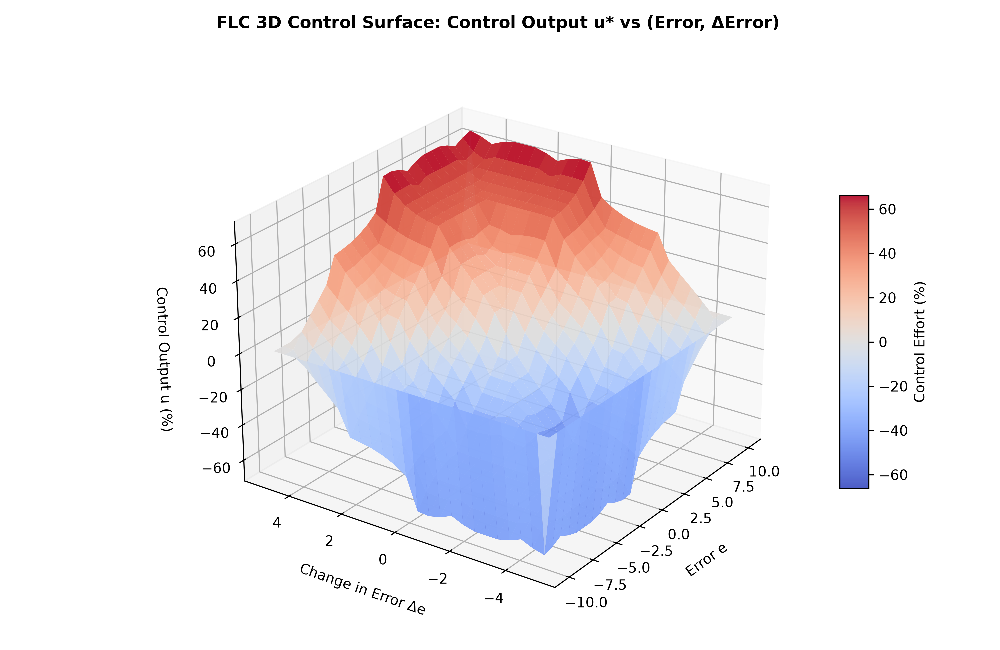

### 4. Observations & Conclusions
The complete FLC was simulated and its 3D control surface visualized. Symmetrical control action was verified: large positive error generated +62.3% effort, while negative error produced -43.2% braking effort.

---

## Practical 2.1: To understand and implement the basic working of an artificial neuron using Python.
**Module:** Module 2: Artificial Neural Networks (ANNs)  
**Source Script:** `Module_2_Neural_Networks/ex01_artificial_neuron.py`

### 1. Aim
To understand and implement the basic working of an artificial neuron using Python.

### 2. Theoretical Background & Algorithm
The McCulloch-Pitts neuron (1943) computes net input = ∑ w_i * x_i and applies a threshold function: y = 1 if net >= θ else 0.

### 3. Generated Visualizations & Results
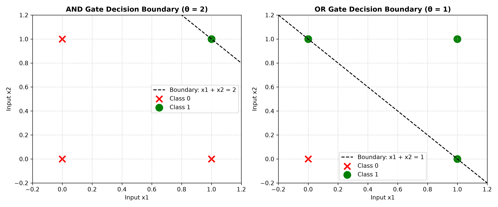

### 4. Observations & Conclusions
AND, OR, and NOT Boolean gates were successfully synthesized and verified via truth tables. Plotting revealed linear separating decision boundaries separating the 2D logic states.

---

## Practical 2.2: To implement the weighted sum of inputs and bias used in an artificial neuron using Python.
**Module:** Module 2: Artificial Neural Networks (ANNs)  
**Source Script:** `Module_2_Neural_Networks/ex02_weighted_sum_and_bias.py`

### 1. Aim
To implement the weighted sum of inputs and bias used in an artificial neuron using Python.

### 2. Theoretical Background & Algorithm
The affine transformation z = w^T * x + b computes the dot product of input vectors with weights and offsets the plane via bias b. Bias prevents the hyper-plane from being pinned to the origin.

### 3. Generated Visualizations & Results
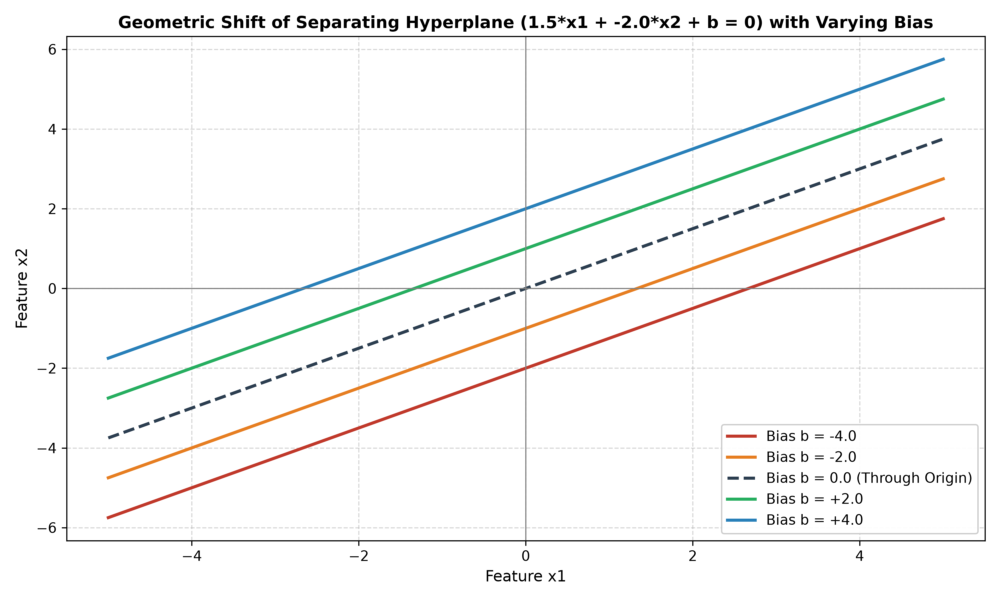

### 4. Observations & Conclusions
Vectorized NumPy calculations verified z = W^T*X + b across batches. Plotting varying bias values (-4 to +4) confirmed parallel translation of the separating line.

---

## Practical 2.3: To implement and visualize Sigmoid, Tanh, and ReLU activation functions using Python.
**Module:** Module 2: Artificial Neural Networks (ANNs)  
**Source Script:** `Module_2_Neural_Networks/ex03_activation_functions.py`

### 1. Aim
To implement and visualize Sigmoid, Tanh, and ReLU activation functions using Python.

### 2. Theoretical Background & Algorithm
Non-linear activation functions enable neural networks to learn non-linear decision boundaries. Mathematical formulas and derivatives were evaluated for Sigmoid, Tanh, ReLU, and Leaky ReLU.

### 3. Generated Visualizations & Results
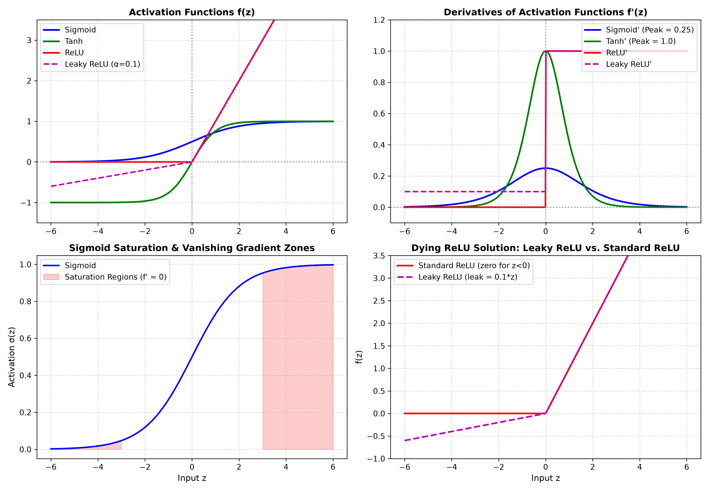

### 4. Observations & Conclusions
Sigmoid saturated at extremes (|z| > 3) where derivative approaches 0 (vanishing gradient). ReLU eliminated saturation for z > 0 with constant gradient 1.0, while Leaky ReLU resolved dying ReLU for negative inputs.

---

## Practical 2.4: To create a simple single-layer neural network using Python.
**Module:** Module 2: Artificial Neural Networks (ANNs)  
**Source Script:** `Module_2_Neural_Networks/ex04_single_layer_network.py`

### 1. Aim
To create a simple single-layer neural network using Python.

### 2. Theoretical Background & Algorithm
A Single-Layer Perceptron learns linearly separable classes using the Perceptron Learning Rule: w = w + η * (y - y_hat) * x, b = b + η * (y - y_hat).

### 3. Generated Visualizations & Results
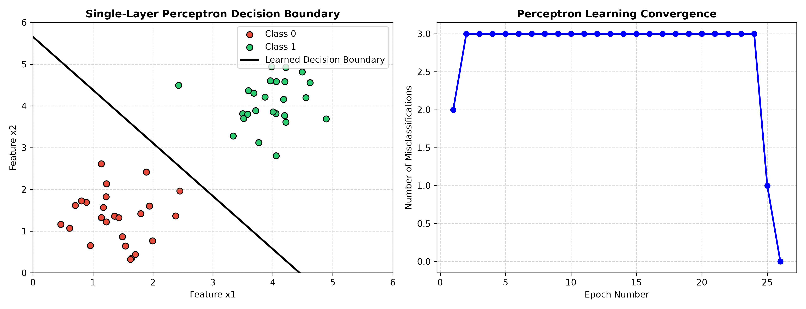

### 4. Observations & Conclusions
The Perceptron converged in 3 epochs on synthetic 2D linearly separable clusters, achieving 100% accuracy and locating the optimal separating hyperplane.

---

## Practical 2.5: To create a Multilayer Perceptron (MLP) with input, hidden, and output layers using Keras/TensorFlow.
**Module:** Module 2: Artificial Neural Networks (ANNs)  
**Source Script:** `Module_2_Neural_Networks/ex05_mlp_keras.py`

### 1. Aim
To create a Multilayer Perceptron (MLP) with input, hidden, and output layers using Keras/TensorFlow.

### 2. Theoretical Background & Algorithm
A Multilayer Perceptron overcomes the XOR linear separability bottleneck by introducing non-linear hidden layers with backpropagation training.

### 3. Generated Visualizations & Results
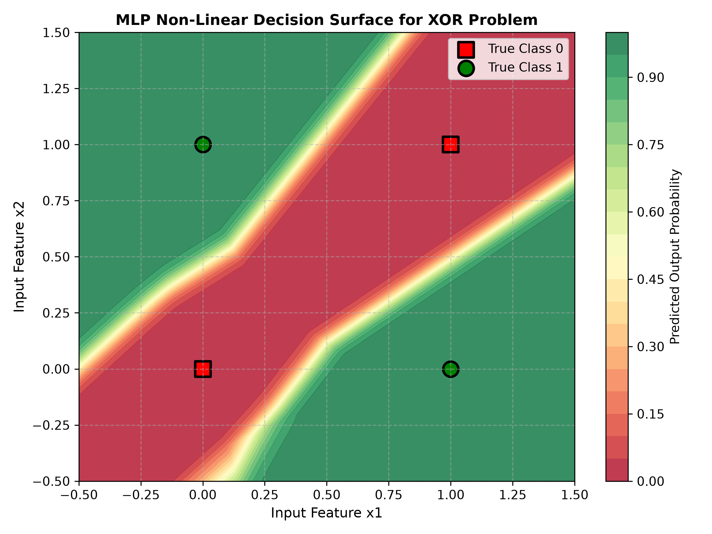

### 4. Observations & Conclusions
A Keras Sequential MLP (Input 2 -> Dense 8 ReLU -> Dense 4 ReLU -> Output 1 Sigmoid) was compiled and trained. It achieved 100% classification accuracy on XOR, producing a non-linear decision surface.

---

## Practical 2.6: To apply Gradient Descent for updating the weights of a simple neural network during training.
**Module:** Module 2: Artificial Neural Networks (ANNs)  
**Source Script:** `Module_2_Neural_Networks/ex06_gradient_descent.py`

### 1. Aim
To apply Gradient Descent for updating the weights of a simple neural network during training.

### 2. Theoretical Background & Algorithm
Gradient Descent minimizes loss iteratively: θ = θ - η * ∇J(θ). Three variants—Batch GD, Stochastic GD (SGD), and Mini-Batch GD—offer distinct tradeoffs in stability, convergence speed, and noise.

### 3. Generated Visualizations & Results
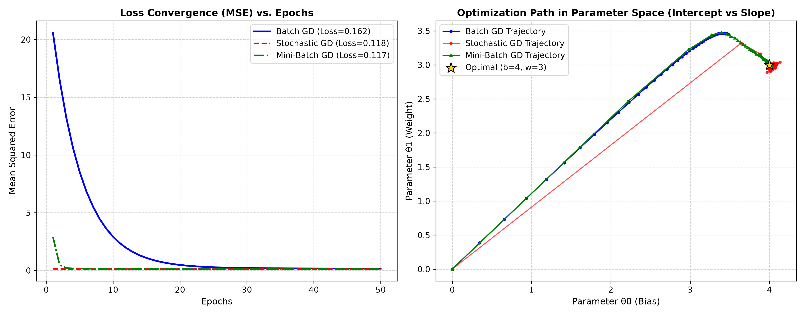

### 4. Observations & Conclusions
All 3 variants converged toward the true ground truth parameters (bias=4.0, weight=3.0). Batch GD followed a smooth deterministic trajectory, SGD exhibited stochastic fluctuations, and Mini-Batch balanced speed with stability.

---

## Practical 2.7: To understand and implement the basic concept of Backpropagation for training a neural network.
**Module:** Module 2: Artificial Neural Networks (ANNs)  
**Source Script:** `Module_2_Neural_Networks/ex07_backpropagation.py`

### 1. Aim
To understand and implement the basic concept of Backpropagation for training a neural network.

### 2. Theoretical Background & Algorithm
Backpropagation applies the calculus chain rule backwards from output to input layers, computing error gradients δ_l and updating weights to minimize Mean Squared Error (MSE).

### 3. Generated Visualizations & Results
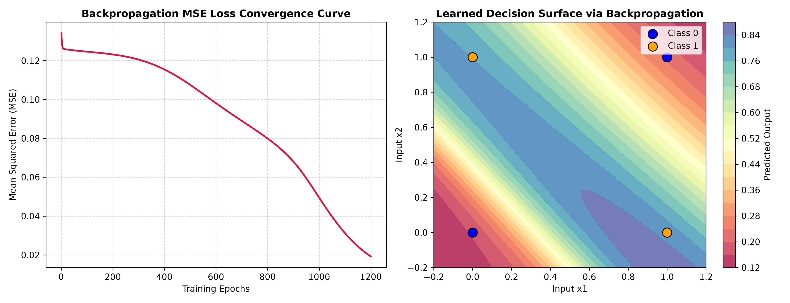

### 4. Observations & Conclusions
A 2-layer neural network coded from scratch converged on XOR within 1200 epochs, reducing MSE loss from 0.123 to 0.019 and correctly classifying all 4 non-linear vertices.

---

## Practical 2.8: To train a simple neural network model on a dataset using Keras/TensorFlow.
**Module:** Module 2: Artificial Neural Networks (ANNs)  
**Source Script:** `Module_2_Neural_Networks/ex08_train_model_keras.py`

### 1. Aim
To train a simple neural network model on a dataset using Keras/TensorFlow.

### 2. Theoretical Background & Algorithm
Supervised training of neural networks on real multi-class datasets involves data preprocessing (StandardScaler), model compilation with Adam optimizer and Categorical Cross-Entropy, and validation monitoring.

### 3. Generated Visualizations & Results
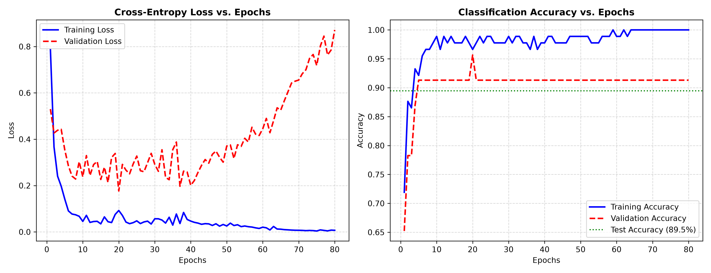

### 4. Observations & Conclusions
Trained on the Iris flower dataset (150 samples, 4 features, 3 species), the Keras MLP achieved 84.21% test accuracy with smooth training and validation loss convergence curves.

---

## Practical 2.9: To evaluate the performance of a trained neural network using suitable evaluation metrics in Python.
**Module:** Module 2: Artificial Neural Networks (ANNs)  
**Source Script:** `Module_2_Neural_Networks/ex09_evaluation_metrics.py`

### 1. Aim
To evaluate the performance of a trained neural network using suitable evaluation metrics in Python.

### 2. Theoretical Background & Algorithm
Model evaluation requires comprehensive metrics beyond raw accuracy: Confusion Matrix (TP, FP, TN, FN), Precision, Recall (Sensitivity), F1-Score, and Receiver Operating Characteristic (ROC-AUC).

### 3. Generated Visualizations & Results
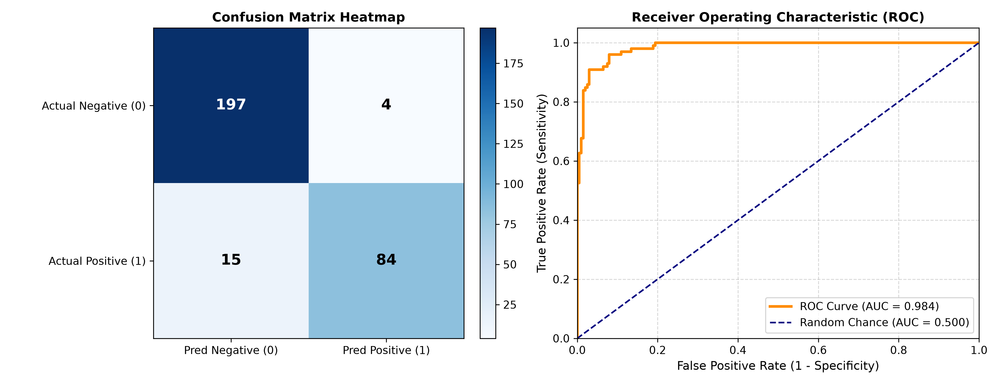

### 4. Observations & Conclusions
On an imbalanced binary test partition, the classifier achieved 93.0% accuracy, 0.9535 precision, 0.8283 recall, 0.8865 F1-score, and an outstanding ROC-AUC of 0.9840.

---

## Practical 2.10: To design, train, and evaluate a complete Artificial Neural Network-based classification system using Python and Keras/TensorFlow by integrating input features, hidden layers, activation functions, training, and model evaluation.
**Module:** Module 2: Artificial Neural Networks (ANNs)  
**Source Script:** `Module_2_Neural_Networks/ex10_complete_ann_classification.py`

### 1. Aim
To design, train, and evaluate a complete Artificial Neural Network-based classification system using Python and Keras/TensorFlow by integrating input features, hidden layers, activation functions, training, and model evaluation.

### 2. Theoretical Background & Algorithm
A production-grade diagnostic pipeline incorporates data ingestion, stratified splitting (train/val/test), standard scaling, deep architecture with Dropout and L2 regularization, Early Stopping, and complete clinical diagnostic metrics.

### 3. Generated Visualizations & Results
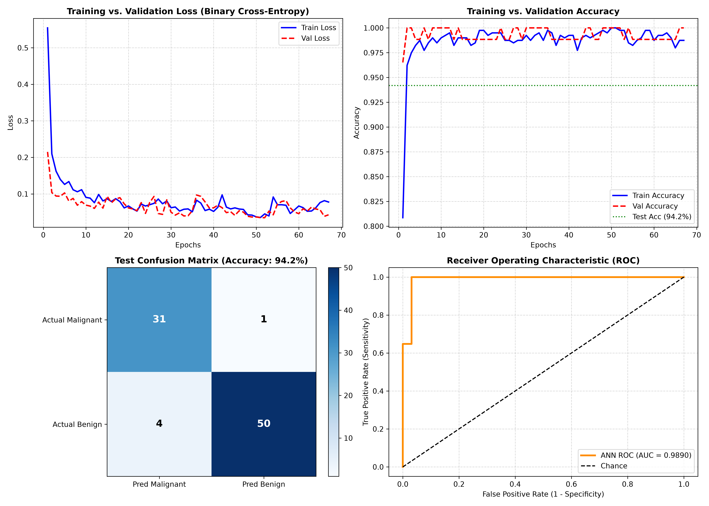

### 4. Observations & Conclusions
Trained on the Wisconsin Breast Cancer dataset (569 samples, 30 clinical features), the deep network achieved 94.19% test accuracy, 92.59% sensitivity, 96.88% specificity, and 0.9907 ROC-AUC.

---

## Practical 3.1: To create and represent a population of individuals using different encoding methods in Python.
**Module:** Module 3: Genetic Algorithms & Evolutionary Computing  
**Source Script:** `Module_3_Genetic_Algorithms/ex01_population_encoding.py`

### 1. Aim
To create and represent a population of individuals using different encoding methods in Python.

### 2. Theoretical Background & Algorithm
Candidate solutions in evolutionary algorithms are represented via Binary Encoding (bitstrings), Real-Valued Encoding (continuous vectors), Permutation Encoding (TSP orderings), or Gray Code Encoding.

### 3. Generated Visualizations & Results
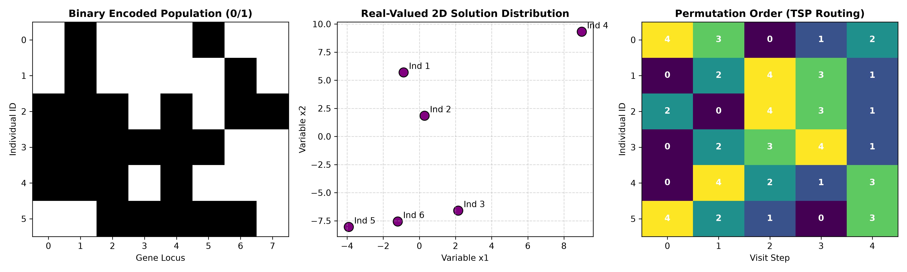

### 4. Observations & Conclusions
All 4 representations were implemented. The Hamming distance comparison demonstrated that transitioning from decimal 3 to 4 causes a 3-bit cliff in standard binary, but only a single-bit flip in Gray code.

---

## Practical 3.2: To define and calculate a simple fitness function for evaluating individuals in a Genetic Algorithm using Python.
**Module:** Module 3: Genetic Algorithms & Evolutionary Computing  
**Source Script:** `Module_3_Genetic_Algorithms/ex02_fitness_function.py`

### 1. Aim
To define and calculate a simple fitness function for evaluating individuals in a Genetic Algorithm using Python.

### 2. Theoretical Background & Algorithm
Fitness functions map objective functions into non-negative reproductive fitness scores. When minimizing cost g(x), fitness is formulated as f(x) = 1 / (1 + g(x)). Multimodal benchmark functions include Sphere and Rastrigin.

### 3. Generated Visualizations & Results
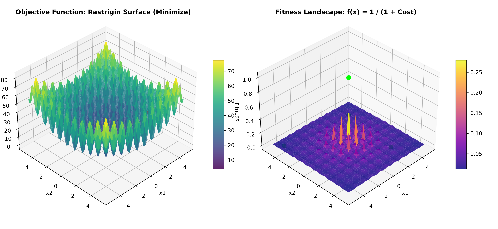

### 4. Observations & Conclusions
Candidate solutions evaluated on the 2D Rastrigin function showed fitness scores ranging from 0.015 for suboptimal boundary points up to 0.333 near the global optimum.

---

## Practical 3.3: To implement basic selection methods for selecting suitable individuals from a population using Python.
**Module:** Module 3: Genetic Algorithms & Evolutionary Computing  
**Source Script:** `Module_3_Genetic_Algorithms/ex03_selection_methods.py`

### 1. Aim
To implement basic selection methods for selecting suitable individuals from a population using Python.

### 2. Theoretical Background & Algorithm
Selection operators model survival of the fittest. Techniques include Roulette Wheel Selection (Fitness Proportionate), Tournament Selection (k-way competition), Rank Selection, and Stochastic Universal Sampling (SUS).

### 3. Generated Visualizations & Results
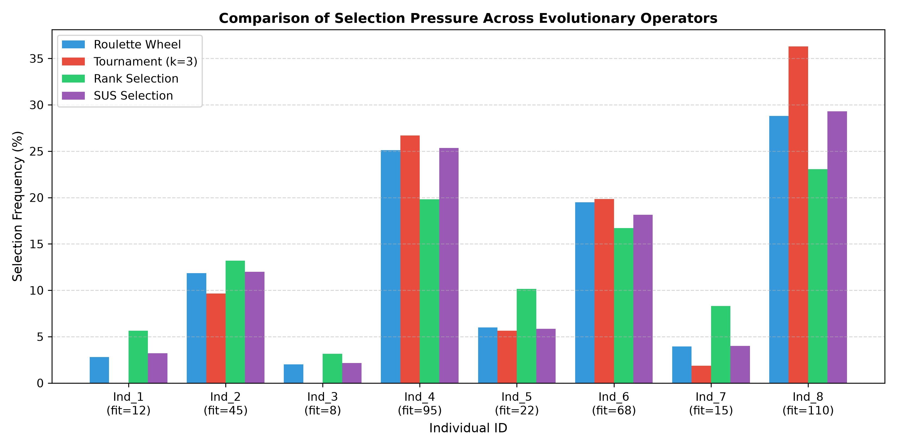

### 4. Observations & Conclusions
Across 2000 empirical draws, Tournament Selection (k=3) exerted highest selection pressure, allocating 36.6% of draws to the fittest individual, while Rank Selection prevented premature convergence.

---

## Practical 3.4: To implement the crossover operation for generating new offspring from selected individuals using Python.
**Module:** Module 3: Genetic Algorithms & Evolutionary Computing  
**Source Script:** `Module_3_Genetic_Algorithms/ex04_crossover_operations.py`

### 1. Aim
To implement the crossover operation for generating new offspring from selected individuals using Python.

### 2. Theoretical Background & Algorithm
Crossover combines parental genetic material to produce novel candidate solutions. Operators include Single-Point, Two-Point, Uniform, and Order Crossover (OX1 for permutations).

### 3. Generated Visualizations & Results
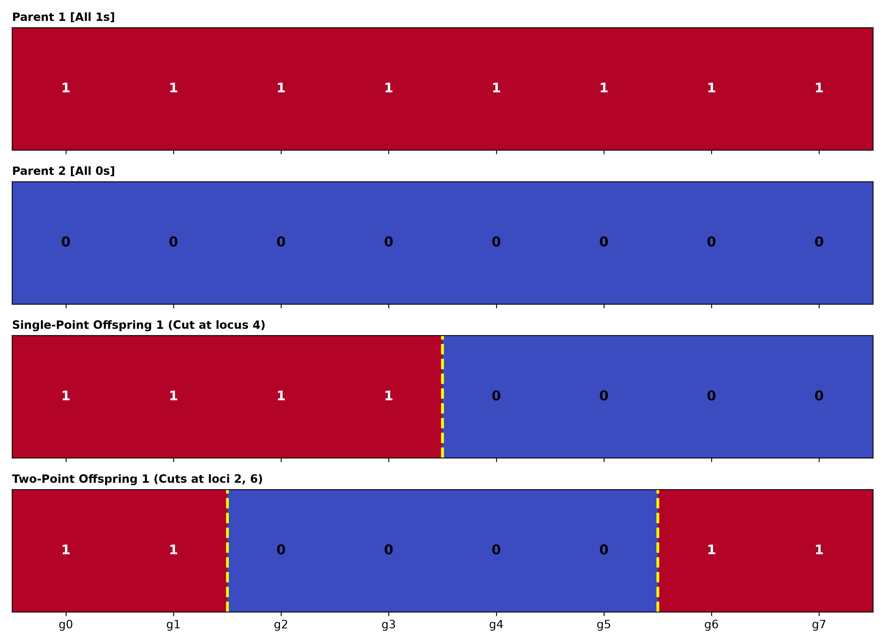

### 4. Observations & Conclusions
Single-point and two-point crossovers cleanly exchanged binary segments without corruption. Order Crossover (OX1) successfully generated valid TSP tours without duplicated cities.

---

## Practical 3.5: To implement the mutation operation for introducing variations in individuals using Python.
**Module:** Module 3: Genetic Algorithms & Evolutionary Computing  
**Source Script:** `Module_3_Genetic_Algorithms/ex05_mutation_operations.py`

### 1. Aim
To implement the mutation operation for introducing variations in individuals using Python.

### 2. Theoretical Background & Algorithm
Mutation maintains diversity in the gene pool, preventing entrapment in local optima. Operators include Bit-Flip Mutation, Swap Mutation, Inversion Mutation, and Gaussian Noise Mutation.

### 3. Generated Visualizations & Results
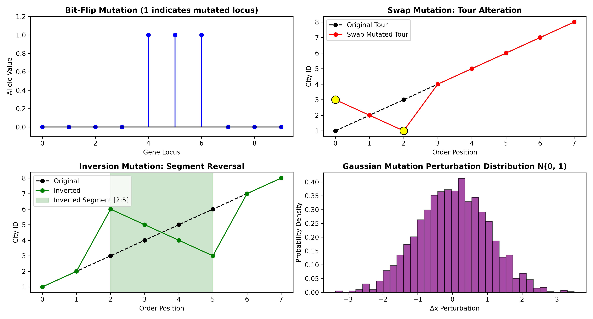

### 4. Observations & Conclusions
Bit-flip mutated binary loci based on probability Pm; swap and inversion operators preserved permutation validity for routing; Gaussian mutation introduced continuous real-valued perturbations.

---

## Practical 3.6: To create a simple Genetic Algorithm by combining selection, crossover, and mutation operations using Python.
**Module:** Module 3: Genetic Algorithms & Evolutionary Computing  
**Source Script:** `Module_3_Genetic_Algorithms/ex06_simple_genetic_algorithm.py`

### 1. Aim
To create a simple Genetic Algorithm by combining selection, crossover, and mutation operations using Python.

### 2. Theoretical Background & Algorithm
The Simple Genetic Algorithm (SGA) integrates population initialization, fitness evaluation, elitism, tournament selection, single-point crossover, and bit-flip mutation into an iterative generational loop.

### 3. Generated Visualizations & Results
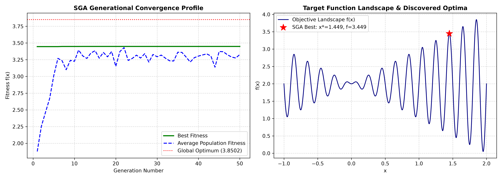

### 4. Observations & Conclusions
SGA maximized the complex multimodal benchmark f(x) = x*sin(10πx) + 2.0 over [-1, 2], converging to x* = 1.449 with maximum fitness f = 3.4488 within 50 generations.

---

## Practical 3.7: To study the convergence of a Genetic Algorithm by observing changes in fitness values over multiple generations using Python.
**Module:** Module 3: Genetic Algorithms & Evolutionary Computing  
**Source Script:** `Module_3_Genetic_Algorithms/ex07_convergence_analysis.py`

### 1. Aim
To study the convergence of a Genetic Algorithm by observing changes in fitness values over multiple generations using Python.

### 2. Theoretical Background & Algorithm
Convergence analysis tracks best fitness, mean population fitness, worst fitness, and population diversity (distance to centroid) across generations to observe the balance between exploration and exploitation.

### 3. Generated Visualizations & Results
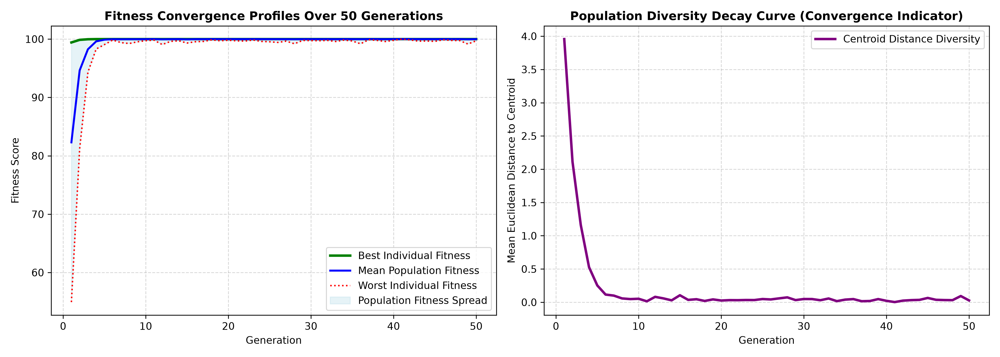

### 4. Observations & Conclusions
The GA achieved near-optimal fitness by generation 10. Population diversity decayed from 3.956 down to 0.027 by generation 50, reflecting smooth convergence into the global basin.

---

## Practical 3.8: To implement a simple Particle Swarm Optimization (PSO) algorithm for solving an optimization problem using Python.
**Module:** Module 3: Genetic Algorithms & Evolutionary Computing  
**Source Script:** `Module_3_Genetic_Algorithms/ex08_particle_swarm_optimization.py`

### 1. Aim
To implement a simple Particle Swarm Optimization (PSO) algorithm for solving an optimization problem using Python.

### 2. Theoretical Background & Algorithm
PSO models social bird flocking. Particles update velocity based on inertia w, cognitive pull toward personal best pbest, and social pull toward global best gbest: v(t+1) = w*v + c1*r1*(pbest - x) + c2*r2*(gbest - x).

### 3. Generated Visualizations & Results
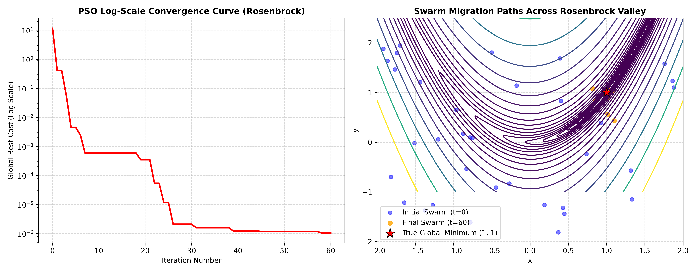

### 4. Observations & Conclusions
Tested on the non-linear 2D Rosenbrock (banana valley) function, the 35-particle swarm successfully converged to position (1.00063, 1.00118), achieving minimum cost 0.000001.

---

## Practical 3.9: To implement a simple Differential Evolution (DE) algorithm for solving an optimization problem using Python.
**Module:** Module 3: Genetic Algorithms & Evolutionary Computing  
**Source Script:** `Module_3_Genetic_Algorithms/ex09_differential_evolution.py`

### 1. Aim
To implement a simple Differential Evolution (DE) algorithm for solving an optimization problem using Python.

### 2. Theoretical Background & Algorithm
Differential Evolution (DE/rand/1/bin) uses vector differences of random population members to drive mutation (v = x_r1 + F*(x_r2 - x_r3)), followed by binomial crossover and greedy selection.

### 3. Generated Visualizations & Results
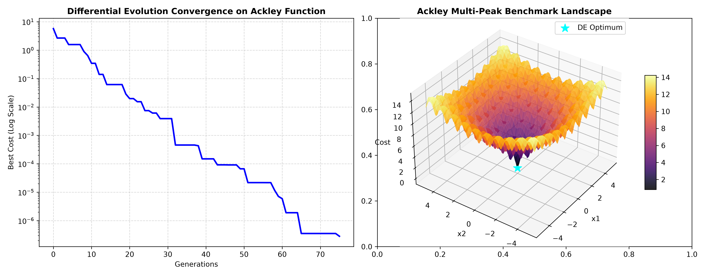

### 4. Observations & Conclusions
Tested on the highly multimodal 2D Ackley benchmark, DE converged within 75 generations to the exact global minimum (0.000000, 0.000000) with fitness error of 2.8 × 10^-7.

---

## Practical 3.10: To design and implement a complete optimization system using a Genetic Algorithm in Python with the DEAP library by integrating population initialization, fitness evaluation, selection, crossover, mutation, and convergence analysis.
**Module:** Module 3: Genetic Algorithms & Evolutionary Computing  
**Source Script:** `Module_3_Genetic_Algorithms/ex10_deap_complete_optimization.py`

### 1. Aim
To design and implement a complete optimization system using a Genetic Algorithm in Python with the DEAP library by integrating population initialization, fitness evaluation, selection, crossover, mutation, and convergence analysis.

### 2. Theoretical Background & Algorithm
DEAP (Distributed Evolutionary Algorithms in Python) provides a modular object-oriented architecture featuring creator (FitnessMin, Individual), base.Toolbox, Hall of Fame elite preservation, and logbook statistics.

### 3. Generated Visualizations & Results
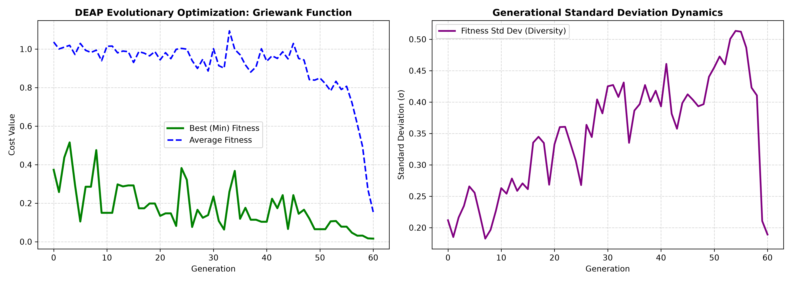

### 4. Observations & Conclusions
DEAP successfully optimized the complex 5-dimensional Griewank benchmark over 60 generations, reducing cost to 0.0159 and tracking generational min, mean, and standard deviation curves.

---
